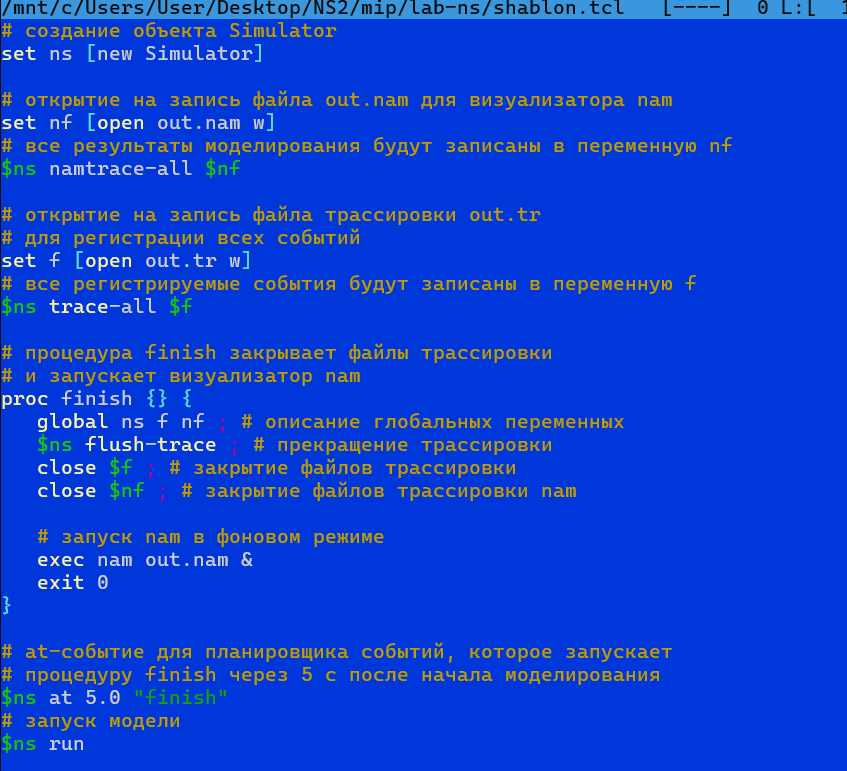
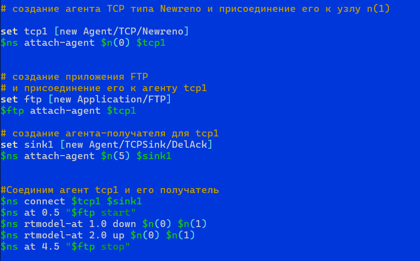

---
# Front matter
lang: ru-RU
title: "Отчет по Лабораторной Работе №1"
subtitle: "Простые модели компьютерной сети"
author: "Озьяс Стев Икнэль Дани"

## Pdf output format
toc: true # Table of contents
toc-depth: 2
fontsize: 12pt
linestretch: 1.5
papersize: a4
documentclass: scrreprt
## I18n polyglossia
polyglossia-lang:
  name: russian
  options:
        - spelling=modern
        - babelshorthands=true
polyglossia-otherlangs:
  name: english
## I18n babel
babel-lang: russian
babel-otherlangs: english
## Fonts
mainfont: PT Serif
romanfont: PT Serif
sansfont: PT Sans
monofont: PT Mono
mainfontoptions: Ligatures=TeX
romanfontoptions: Ligatures=TeX
sansfontoptions: Ligatures=TeX,Scale=MatchLowercase
monofontoptions: Scale=MatchLowercase,Scale=0.9
## Biblatex
biblatex: true
biblio-style: "gost-numeric"
biblatexoptions:
  - parentracker=true
  - backend=biber
  - hyperref=auto
  - language=auto
  - autolang=other*
  - citestyle=gost-numeric
## Pandoc-crossref LaTeX customization
figureTitle: "Рис."
tableTitle: "Таблица"
listingTitle: "Листинг"
lofTitle: "Цель Работы"
lotTitle: "Ход Работы"
lolTitle: "Листинги"
## Misc options
indent: true
header-includes:
  - \usepackage{indentfirst}
  - \usepackage{float} # keep figures where there are in the text
  - \floatplacement{figure}{H} # keep figures where there are in the text
---

# Цель работы

Приобретение навыков моделирования сетей передачи данных с помощью средства имитационного моделирования NS-2, а также анализ полученных результатов
моделирования.

# Выполнение лабораторной работы

## Задача 1

В своём рабочем каталоге создал директорию mip, к которой будут выполняться лабораторные работы. Внутри mip создал директорию lab-ns, а в ней файл
shablon.tcl:

{ #fig:001 width=70% }

Отредактировал файл shablon.tcl с помощью mc:

{ #fig:002 width=70% }

Запустил его командой $ns$. На экране появился пустой симулятор поскольку ещё не определены никакие объекты и действия:

{ #fig:003 width=70% }

## Задача 2

На базе файла shablon.tcl, создал файл example1.tcl и отредактировал его.

{ #fig:003 width=70% }

Смоделировал сеть передачи данных, состоящую из двух узлов, соединённых дуплексной линией связи с полосой пропускания 2 Мб/с и задержкой 10 мс, очередью с обслуживанием типа DropTail. От одного узла к другому по протоколу UDP осуществляется передача пакетов, размером 500 байт, с постоянной скоростью 200 пакетов в секунду.
При нажатии на кнопку play в окне nam через 0.5 секунды из узла 0 данные начнут поступать к узлу 1. 

{ #fig:004 width=70% }

## Задача 3

На базе файла shablon.tcl, создал файл example2.tcl и отредактировал его.

{ #fig:003 width=70% }

Смоделировал сеть со следующими характеристиками:

– сеть состоит из 4 узлов (n0, n1, n2, n3);
– между узлами n0 и n2, n1 и n2 установлено дуплексное соединение с пропускной способностью 2 Мбит/с и задержкой 10 мс;
– между узлами n2 и n3 установлено дуплексное соединение с пропускной способностью 1,7 Мбит/с и задержкой 20 мс;
– каждый узел использует очередь с дисциплиной DropTail для накопления пакетов, максимальный размер которой составляет 10;
– TCP-источник на узле n0 подключается к TCP-приёмнику на узле n3 (по-умолчанию, максимальный размер пакета, который TCP-агент может генерировать, равняется 1KByte)
– TCP-приёмник генерирует и отправляет ACK пакеты отправителю и откидывает полученные пакеты;
– UDP-агент, который подсоединён к узлу n1, подключён к null-агенту на узле n3 (null-агент просто откидывает пакеты);
– генераторы трафика ftp и cbr прикреплены к TCP и UDP агентам соответственно;
– генератор cbr генерирует пакеты размером 1 Кбайт со скоростью 1 Мбит/с;
– работа cbr начинается в 0,1 секунду и прекращается в 4,5 секунды, а ftp начинает работать в 1,0 секунду и прекращает в 4,0 секунды.

При запуске скрипта можно заметить, что по соединениям между узлами n(0)–n(2) и n(1)–n(2) к узлу n(2) передаётся данных больше, чем способно передаваться по соединению от узла n(2) к узлу n(3). Действительно, мы передаём 200 пакетов в секунду от каждого источника данных в узлах n(0) и n(1), а каждый пакет имеет размер 500 байт. Таким образом, полоса каждого соединения 0, 8 Mb, а суммарная — 1, 6 Mb. Но соединение n(2)–n(3) имеет полосу лишь 1 Mb. Следовательно, часть пакетов должна теряться. В окне аниматора можно видеть пакеты в очереди, а также те пакеты, которые отбрасываются при переполнении.

{ #fig:004 width=70% }

## Задача 4

На базе файла shablon.tcl, создал файл example3.tcl и отредактировал его.

{ #fig:003 width=70% }

Построил модель передачи данных по сети с кольцевой топологией и динамической маршрутизацией пакетов:
– сеть состоит из 7 узлов, соединённых в кольцо;
– данные передаются от узла n(0) к узлу n(3) по кратчайшему пути;
– с 1 по 2 секунду модельного времени происходит разрыв соединения между узлами n(1) и n(2);
– при разрыве соединения маршрут передачи данных должен измениться на резервный.

Сразу после запуска в сети отправляется небольшое количество маленьких пакетов, используемых для обмена информацией, необходимой для маршрутизации между узлами (рис. 1.6). Когда соединение будет разорвано, информация о топологии будет обновлена, и пакеты будут отсылаться по новому маршруту через узлы n(6), n(5) и n(4).

{ #fig:004 width=70% }

## Задача 5

На базе файла example3.tcl, создал файл example4.tcl и отредактировал его. 

Внес следующие изменения в реализацию примера с кольцевой топологией сети:

– передача данных должна осуществляться от узла n(0) до узла n(5) по кратчайшему пути в течение 5 секунд модельного времени;
– передача данных должна идти по протоколу TCP (тип Newreno), на принимающей стороне используется TCPSink-объект типа DelAck; поверх TCP работает протокол FTP с 0,5 до 4,5 секунд модельного времени;
– с 1 по 2 секунду модельного времени происходит разрыв соединения между узлами n(0) и n(1);
– при разрыве соединения маршрут передачи данных должен измениться на резервный, после восстановления соединения пакеты снова должны пойти по кратчайшему пути.

{ #fig:003 width=70% }

До разрыва данные передаются по кратчайшему пути от узла от узла n(0) до узла n(5) только через узел n(1).

{ #fig:004 width=70% }

При разрыве данные передаются по длинному маршруту n(0)-n(4)-n(3)-n(2)-n(1)-n(5).

{ #fig:004 width=70% }

После восстановления разрыва данные передаются снова по кратчайшему пути

{ #fig:004 width=70% }

# Выводы

В результате проделанной лабораторной работы мы приобрели полезные навыки моделирования сетей передачи данных с помощью средства имитационного моделирования NS-2, а также выпольнили анализ полученных результатов моделирования.