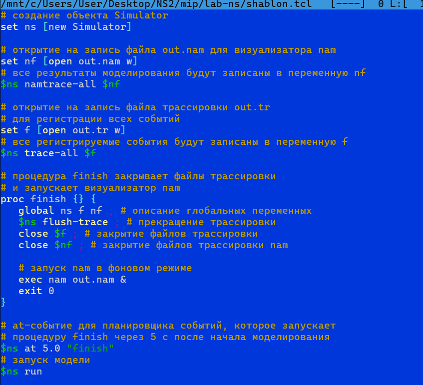
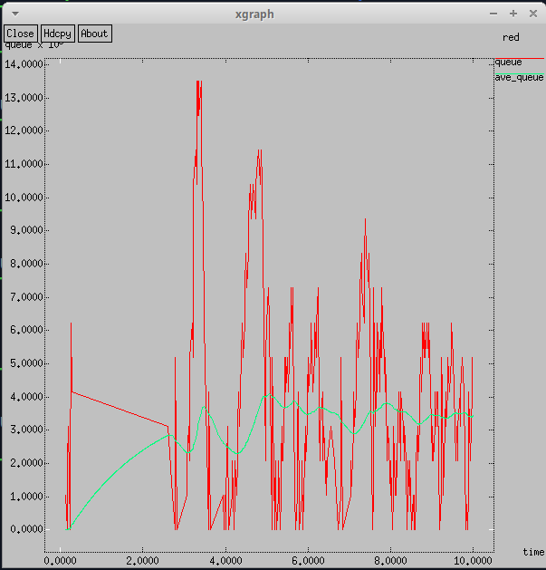
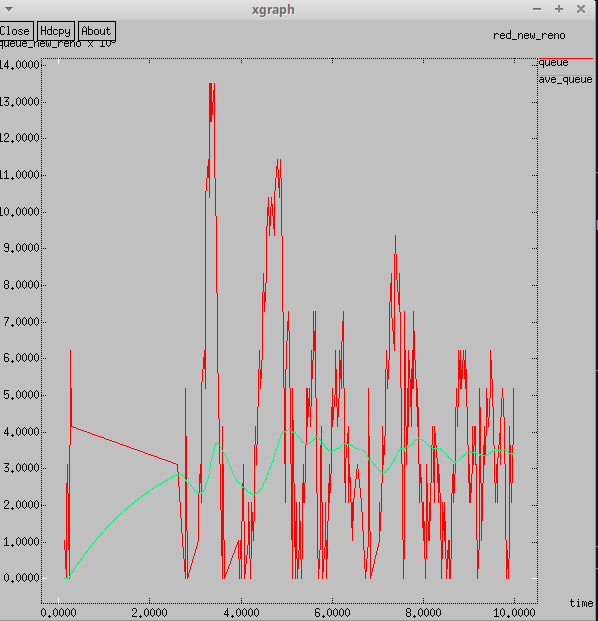
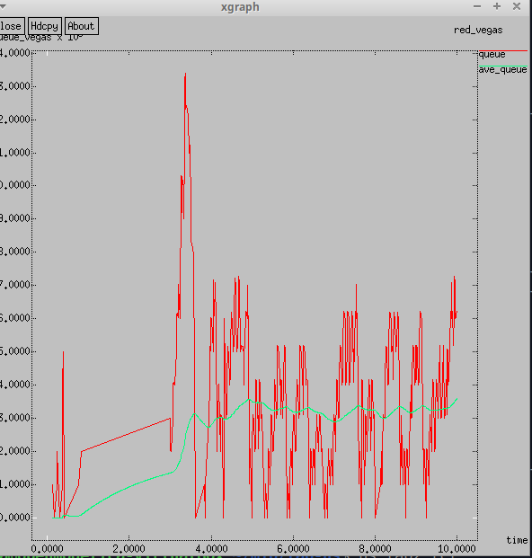
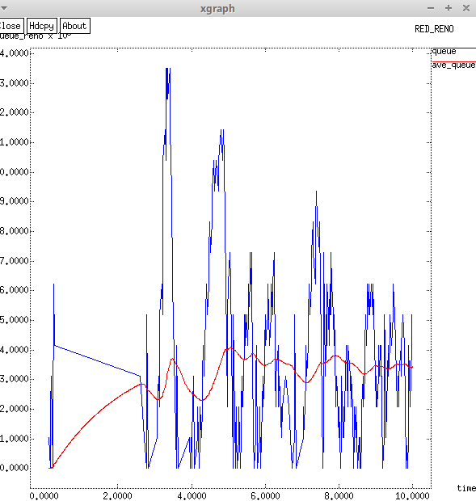
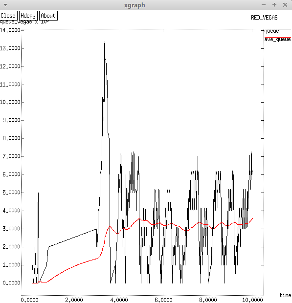

---
## Front matter
title: "Презентация по лабораторной работе №2"
subtitle: "Протокол TCP и алгоритм управления очередью RED"
author: "Озьяс Стев Икнэль Дани"

## Generic otions
lang: ru-RU

## Formatting
toc: false
slide_level: 2
theme: metropolis
header-includes:
- \metroset{progressbar=frametitle,sectionpage=progressbar,numbering=fraction}
- '\makeatletter'
- '\beamer@ignorenonframefalse'
- '\makeatother'
aspectratio: 43
section-titles: true
---

# Информация

## Докладчик

:::::::::::::: {.columns align=center}
::: {.column width="70%"}

  * Озьяс Стев Икнэль Дани
  * студент группы НКНбд-01-21
  * Российский университет дружбы народов
  * <https://github.com/Dacossti>

:::
::: {.column width="30%"}


:::
::::::::::::::

# Цели и задачи работы

## Цель лабораторной работы
 
Исследование протокола TCP и алгоритма управления очередью RED

# Выполнение лабораторной работы


## Задача 1

Рассмотрел пример моделирования сети со следующими характеристиками:

- сеть состоит из 6 узлов;
- между всеми узлами установлено дуплексное соединение с различными пропускной способностью и задержкой 10 мс (см. рис. 2.4);
- узел r1 использует очередь с дисциплиной RED для накопления пакетов, максимальный размер которой составляет 25;
- TCP-источники на узлах s1 и s2 подключаются к TCP-приёмнику на узле s3;
- генераторы трафика FTP прикреплены к TCP-агентам.

##

На базе файла shablon.tcl, создал файл lab2.tcl и отредактировал его.

{ #fig:001 width=70% }

##

Запустил его командой $ns$.

{ #fig:002 width=70% }

{ #fig:003 width=70% }


## Задача 2


Отредактировал файл lab2.tc, изменив в модели на узле s1 тип протокола TCP с Reno на NewReno:
```
set tcp1 [$ns create-connection TCP/NewReno $node_(s1) TCPSink $node_(s3) 0]
```

{ #fig:004 width=70% }

##

Отредактировал файл lab2.tc, изменив в модели на узле s1 тип протокола TCP с NewReno на Vegas:
```
set tcp1 [$ns create-connection TCP/Vegas $node_(s1) TCPSink $node_(s3) 0]
```

{ #fig:005 width=70% }

##

Внес сдледующие изменения при отображении окон с графиками:

- Изменение цвета фона:
```
-bg <color> #например -bg white
```
- Изменение цвета траекторий: 
```
puts $f "i.color : <color>"$  #при 0<i<7
```
- Изменение подписей к осям: указывая при запуске xgraph 
```
$-x <name>$ или $-y <name>$  #для осей абцисс и ординат соответственно
```

- Изменение подписи траектории в легенде: 
```
$puts $f "TitleText: <text>" # в файле запуска мониторинга 
```
или 

```
$-t <text>$ #при запуске xgraph
```
##

{ #fig:006 width=70% }

##

{ #fig:007 width=70% }


# Выводы

В результате проделанной лабораторной работы мы изучили протокол TCP и алгоритм управления очередью RED.