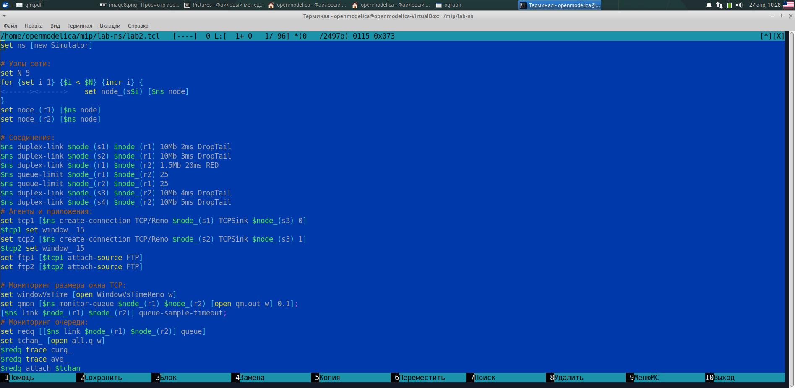
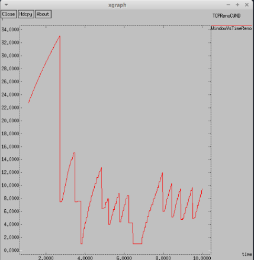

---
## Front matter
title: "Презентация по лабораторной работе №1"
subtitle: "Простые модели компьютерной сети"
author: "Озьяс Стев Икнэль Дани"

## Generic otions
lang: ru-RU

## Formatting
toc: false
slide_level: 2
theme: metropolis
header-includes:
- \metroset{progressbar=frametitle,sectionpage=progressbar,numbering=fraction}
- '\makeatletter'
- '\beamer@ignorenonframefalse'
- '\makeatother'
aspectratio: 43
section-titles: true
---

# Информация

## Докладчик

:::::::::::::: {.columns align=center}
::: {.column width="70%"}

  * Озьяс Стев Икнэль Дани
  * студент группы НКНбд-01-21
  * Российский университет дружбы народов
  * <https://github.com/Dacossti>

:::
::: {.column width="30%"}

:::
::::::::::::::

# Цели и задачи работы

## Цель лабораторной работы
 
Исследование протокола TCP и алгоритма управления очередью RED

# Выполнение лабораторной работы

## Задача 1

Рассмотрел пример моделирования сети со следующими характеристиками:

- сеть состоит из 6 узлов;
- между всеми узлами установлено дуплексное соединение с различными пропускной способностью и задержкой 10 мс (см. рис. 2.4);
- узел r1 использует очередь с дисциплиной RED для накопления пакетов, максимальный размер которой составляет 25;
- TCP-источники на узлах s1 и s2 подключаются к TCP-приёмнику на узле s3;
- генераторы трафика FTP прикреплены к TCP-агентам.

## Задача 1 

На базе файла shablon.tcl, создал файл lab2.tcl и отредактировал его.

{ #fig:001 width=70% }

## Задача 1

Запустил его командой $ns$.

{ #fig:002 width=70% }

## Задача 2

Отредактировал файл lab2.tc, изменив в модели на узле s1 тип протокола TCP с Reno на NewReno:

{ #fig:003 width=70% }

## Задача 2

Отредактировал файл lab2.tc, изменив в модели на узле s1 тип протокола TCP с Reno на NewReno:

{ #fig:003 width=70% }

## Задача 2

Внес сдледующие изменения при отображении окон с графиками:

- Изменение цвета фона

{ #fig:004 width=70% }

## Задача 2

- Изменение цвета траекторий

{ #fig:005 width=70% }

## Задача 2

- Изменение подписей к осям

{ #fig:006 width=70% }

## Задача 2

- Изменение подписи траектории в легенде

{ #fig:007 width=70% }

# Выводы

В результате проделанной лабораторной работы мы изучили протокол TCP и алгоритм управления очередью RED.