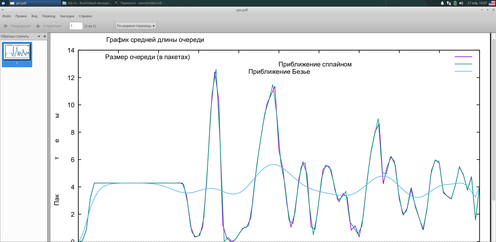

---
## Front matter
title: "Презентация по лабораторной работе №3"
subtitle: "Моделирование стохастических процессов"
author: "Озьяс Стев Икнэль Дани"

## Generic otions
lang: ru-RU

## Formatting
toc: false
slide_level: 2
theme: metropolis
header-includes:
- \metroset{progressbar=frametitle,sectionpage=progressbar,numbering=fraction}
- '\makeatletter'
- '\beamer@ignorenonframefalse'
- '\makeatother'
aspectratio: 43
section-titles: true
---

# Информация

## Докладчик

:::::::::::::: {.columns align=center}
::: {.column width="70%"}

  * Озьяс Стев Икнэль Дани
  * студент группы НКНбд-01-21
  * Российский университет дружбы народов
  * <https://github.com/Dacossti>

:::
::: {.column width="30%"}

:::
::::::::::::::

# Цели и задачи работы

## Цель лабораторной работы
 
Моделирование стохастических процессов

# Выполнение лабораторной работы

## Задача 1

На базе файла shablon.tcl, создал файл lab3.tcl и отредактировал его.

{ #fig:001 width=70% }

## Задача 2

В каталоге с проектом создал отдельный файл $graph_plot$. Открыл его на редактирование и добавил следующий код, обращая внимание:

{ #fig:002 width=70% }

## Задача 3

Сделал файл graph_plot исполняемым. Запустил симулятор lab3.tcl.

{ #fig:003 width=70% }

##

После компиляции файла с проектом, запустил скрипт в созданном файле graph_plot, который создаст файл qm.pdf с результатами моделирования:

{ #fig:004 width=70% }

# Выводы

В результате проделанной лабораторной работы мы приобрели полезные навыки моделирования сетей передачи данных с помощью средства имитационного моделирования NS-2, а также выпольнили анализ полученных результатов моделирования.